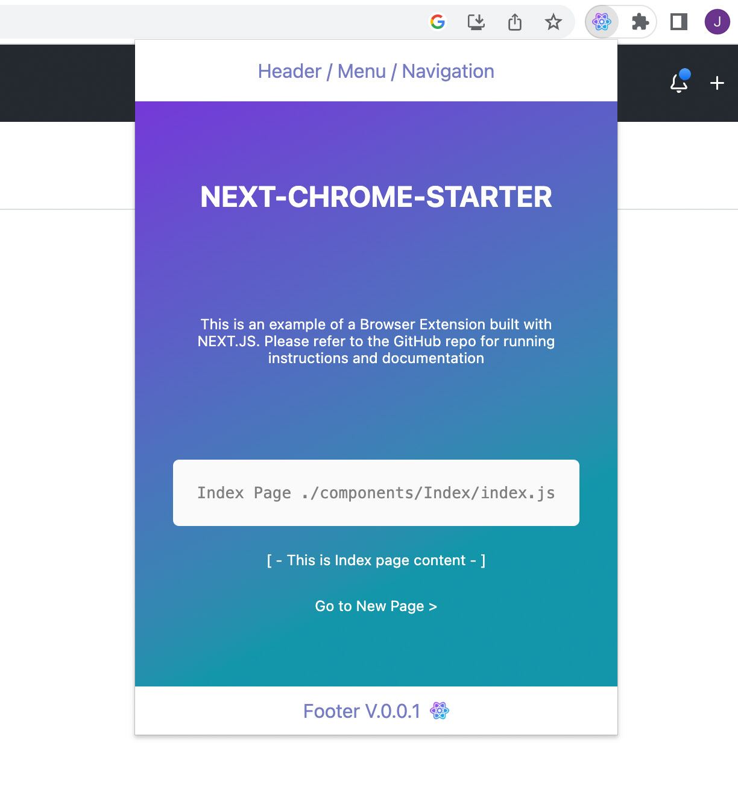
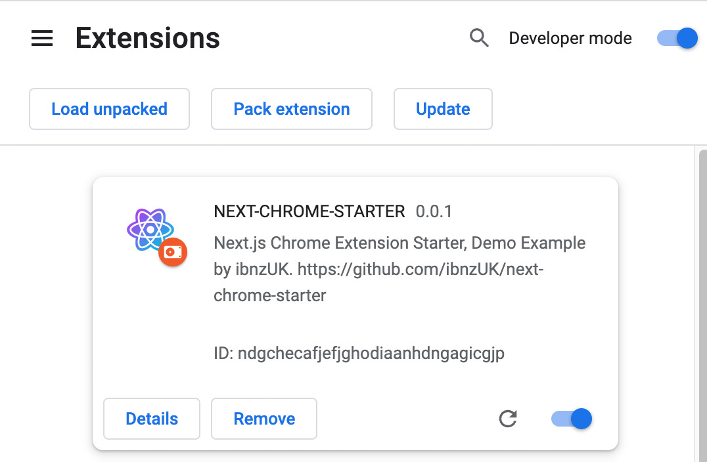

# LeaseCalc Chrome Extension 🧮

A powerful Chrome extension that enhances the LeaseCalc web application with seamless browser integration and additional features.

## Table of Contents ✨  

- [Description](#description)
- [Installation](#installation)
- [Usage](#usage)
- [Contributing](#contributing)
- [License](#license)

# Description

LeaseCalc Chrome Extension extends the functionality of the LeaseCalc web application directly in your browser. This extension provides quick access to lease calculations and management features without leaving your current webpage.



# Installation

To install and run LeaseCalc Chrome Extension locally, follow these steps:

1. Clone this repository
2. Navigate to project directory: 
   ```
   cd lease-calc-extension
   ```
3. Install the dependencies using npm: 
   ```
   npm install
   ```

# Usage
## Development Mode 🔥
To run the extension in development mode:

```
npm run dev
```
`This will run the development server on localhost`

 http://localhost:3000/

## Build and Install in Chrome 🔥
To build and install the extension in Chrome:

1. Build the project:
```
npm run build
```
`This will create the extension files in the 'out/' directory`

2. Open Google Chrome and navigate to `chrome://extensions/`
3. Enable "Developer mode" in the top right corner
4. Click "Load unpacked" and select the `out` directory
5. The LeaseCalc extension icon should now appear in your Chrome toolbar



## Features
- Quick access to LeaseCalc functionality from any webpage
- Integration with the LeaseCalc web application
- Streamlined lease calculations
- Browser toolbar integration
- Offline capability

# Contributing
Contributions to LeaseCalc Chrome Extension are welcome! If you find any issues or have suggestions for improvements, please feel free to open an issue or submit a pull request.

# License
This project is licensed under the MIT License.

Feel free to customize and modify it based on your specific requirements. 
Make sure to include any additional information, such as troubleshooting tips or specific 
functionality, to provide a comprehensive guide for users.

```
MIT License

Copyright (c) 2025 Mohammed Isa

Permission is hereby granted, free of charge, to any person obtaining a copy
of this software and associated documentation files (the "Software"), to deal
in the Software without restriction, including without limitation the rights
to use, copy, modify, merge, publish, distribute, sublicense, and/or sell
copies of the Software, and to permit persons to whom the Software is
furnished to do so, subject to the following conditions:

The above copyright notice and this permission notice shall be included in all
copies or substantial portions of the Software.

THE SOFTWARE IS PROVIDED "AS IS", WITHOUT WARRANTY OF ANY KIND, EXPRESS OR
IMPLIED, INCLUDING BUT NOT LIMITED TO THE WARRANTIES OF MERCHANTABILITY,
FITNESS FOR A PARTICULAR PURPOSE AND NONINFRINGEMENT. IN NO EVENT SHALL THE
AUTHORS OR COPYRIGHT HOLDERS BE LIABLE FOR ANY CLAIM, DAMAGES OR OTHER
LIABILITY, WHETHER IN AN ACTION OF CONTRACT, TORT OR OTHERWISE, ARISING FROM,
OUT OF OR IN CONNECTION WITH THE SOFTWARE OR THE USE OR OTHER DEALINGS IN THE
SOFTWARE.
